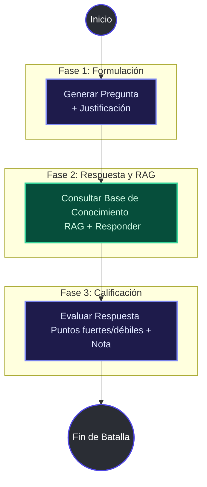

# ⚔️ Batalla de Chatbots: Profesor IA vs Alumno IA

[](https://www.python.org/)
[](https://fastapi.tiangolo.com/)
[](https://github.com/langchain-ai/langgraph)
[](https://www.docker.com/)
[](https://docs.pytest.org/)

¡Bienvenido al simulador interactivo de debate y evaluación educativa automatizada! Este proyecto utiliza **sistemas multi-agente** orquestados a través de un grafo de estados de **LangGraph**, expone una API rápida con **FastAPI** y cuenta con una interfaz web interactiva con una estética premium moderna (*Glassmorphism*).

---

## 📖 Descripción del Flujo

El sistema simula un flujo pedagógico lineal completo y estructurado en tres fases clave a través de un grafo de estados:



1. **Profesor IA (Formulación)**: A partir del temario provisto por el usuario, formula una pregunta conceptualmente profunda junto con su justificación didáctica objetiva.
2. **Alumno IA (Generación Aumentada por Recuperación - RAG)**: Consulta una base de conocimiento documental estática para redactar una respuesta fundamentada científicamente, listando las fuentes referenciadas de manera explícita.
3. **Profesor IA (Evaluación)**: El Profesor analiza la respuesta del alumno y emite una calificación objetiva (de `0.0` a `10.0`), un feedback estructurado, puntos fuertes identificados y áreas de mejora.

---

## 🌟 Características Destacadas

*   **Estética Premium Modernizada**: Interfaz web SPA construida con Vanilla HTML/CSS/JS con diseño *dark-mode* profundo, efectos hover fluidos, animaciones secuenciales y diseño responsivo adaptado a todos los dispositivos.
*   **Flyweight Pattern / lru_cache**: Reutilización inteligente de instancias de LLM basadas en la temperatura solicitada para mejorar la velocidad de respuesta del sistema y ahorrar memoria.
*   **Validación de Claves (Anti-Placeholders)**: Sistema que detiene la ejecución inmediatamente si detecta claves vacías o placeholders del entorno (como `tu_api_key_aqui`), proporcionando instrucciones precisas en lugar de errores crípticos de las APIs externas.
*   **Suite de Pruebas**: 12 pruebas unitarias y de integración implementadas con `pytest` y `pytest-mock` para asegurar la robustez de los controladores, endpoints y la factoría de LLMs.

---

## 📋 Configuración del Entorno (.env)

El simulador soporta múltiples proveedores de LLM de forma nativa. Configura tus credenciales copiando el archivo de ejemplo:

```bash
cp .env.example .env
```

| Variable de Entorno | Proveedor | Modelo Recomendado | Notas |
| :--- | :--- | :--- | :--- |
| `LLM_PROVIDER` | Todos | `openai` \| `gemini` \| `groq` \| `ollama` | Define el backend activo. |
| `OPENAI_API_KEY` | OpenAI | `gpt-4o-mini` | Clave API de OpenAI (`sk-...`). |
| `GEMINI_API_KEY` | Gemini | `gemini-1.5-flash` | Clave API de Google AI Studio (Gratuito). |
| `GROQ_API_KEY` | Groq | `llama-3.3-70b-versatile` | Clave API de Groq Cloud. |
| `OLLAMA_BASE_URL` | Ollama | `llama3.2:1b` | Opcional. URL de tu instancia local. |

> [!WARNING]
> No dejes los valores de ejemplo en el archivo `.env`. El backend detectará automáticamente palabras clave como `"tu_api_key"` o `"api_key_aqui"` y lanzará un error guiado si intentas iniciar una batalla.

---

## 🚀 Guía de Inicio Rápido

### Opción A: Ejecución con Docker (Recomendado)

Si tienes Docker y Docker Compose instalados, puedes levantar el proyecto completo en segundos:

1. **Construir y levantar contenedores:**
   ```bash
   docker compose up -d --build
   ```
2. **Acceder a la interfaz:**
   Abre [**http://localhost:8000**](http://localhost:8000) en tu navegador web.

---

### Opción B: Ejecución Local en tu Entorno de Desarrollo

1. **Crear y activar el entorno virtual:**
   ```bash
   python -m venv .venv
   
   # En Windows:
   .venv\Scripts\Activate.ps1
   # En macOS/Linux:
   source .venv/bin/activate
   ```

2. **Instalar dependencias:**
   ```bash
   pip install -r requirements.txt
   ```

3. **Iniciar el servidor de desarrollo:**
   ```bash
   python -m uvicorn src.app:app --reload --port 8000
   ```

---

## 🖥️ Interfaz Web y Uso

Una vez que el servidor se esté ejecutando en el puerto `8000`:

*   **Consola Interactiva**: Accede a [**http://localhost:8000**](http://localhost:8000) y podrás:
    *   Utilizar **Plantillas Rápidas** de temario (e.g. *LangGraph, Deep Learning, FastAPI*) con un solo click.
    *   Ver el progreso paso a paso de la simulación mediante loaders visuales y líneas de tiempo.
    *   Consultar el historial y el rendimiento promedio (nota media) guardado de forma persistente en tu navegador (`localStorage`).
*   **Prueba en Terminal**: Ejecuta una simulación directa por consola con:
    ```bash
    python test_battle.py
    ```

---

## 🔗 Endpoints de la API

| Endpoint | Método | Descripción |
| :--- | :--- | :--- |
| `GET /` | `GET` | Sirve la interfaz web HTML/CSS/JS interactiva. |
| `GET /health` | `GET` | Comprueba el estado de salud de la API. |
| `POST /start_battle` | `POST` | Inicia una nueva simulación. Recibe un JSON `{"temario": "..."}`. |
| `GET /docs` | `GET` | Interfaz interactiva de Swagger para pruebas rápidas. |

---

## 🧪 Pruebas Automatizadas

La suite de pruebas automatizadas está preparada para ejecutarse en entornos aislados con el objetivo de prevenir consumos innecesarios en producción.

### Ejecutar Pruebas dentro de Docker
```bash
docker exec -it batalla_chatbots_api pytest
```

### Ejecutar Pruebas de Forma Local
```bash
pytest
```

> [!TIP]
> Las pruebas simulan el grafo de LangGraph mediante mocking (`pytest-mock`), lo que te permite validar toda la lógica de los endpoints y los esquemas de Pydantic sin necesidad de configurar claves de API válidas en tu máquina de desarrollo local.